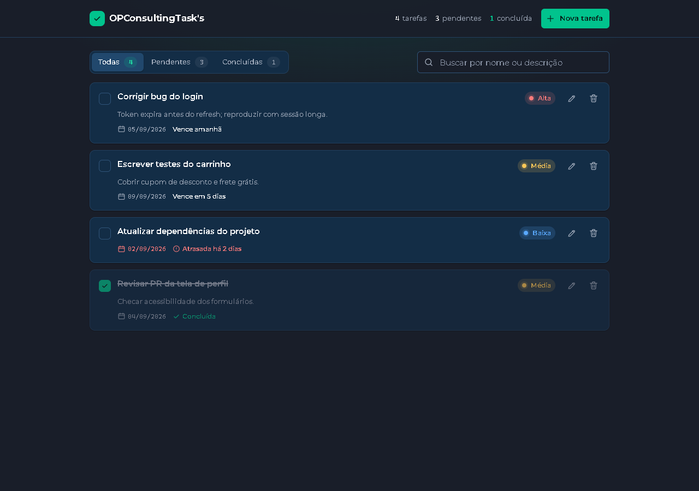

# ConsultingTask's

Gerenciador de tarefas para desenvolvedores, feito em **React + Vite + JavaScript + CSS** com persistência automática em **localStorage**.

Projeto desenvolvido para o **Checkpoint 4** da disciplina de Frontend do curso de Engenharia de Software da **FIAP**.



## Integrantes

| Nome | RM |
|------|----|
| Felipe Rossano Pedrol | 569631 |
| Jecky Cossio | 572226 |
| Daniel Roberto Ribeiro de Figueiredo | 571746 |
| Felipi Bandeira de Godoy | 573741 |
| Leonardo Ferreira Barbosa | 571311 |

## Repositório

<!-- Substitua pelo link do repositório no GitHub -->
https://github.com/USUARIO/REPOSITORIO

## Funcionalidades

Requisitos do checkpoint:

- Cadastro de tarefas com **nome, prazo, descrição e nível de prioridade** (baixa, média, alta)
- **Marcar como concluída** e **remover** (com confirmação inline)
- Filtros rápidos: **Todas · Pendentes · Concluídas**
- **Persistência automática** em localStorage (chave `devtask:tasks`)

Melhorias de produto (além do exigido):

- **Editar** uma tarefa existente
- **Busca** por nome ou descrição, sem diferenciar acentos, combinada com os filtros
- Destaque de prazo: *vence hoje*, *vence amanhã*, *atrasada há N dias*
- Formulário sob demanda: **Nova tarefa** abre o cadastro no topo da lista; editar transforma o próprio card no formulário. Atalhos **Esc** (fechar) e **Ctrl+Enter** (salvar)
- Estados vazios com orientação, layout responsivo (celular e desktop) e acessibilidade básica (labels, foco visível, textos para leitores de tela)

## Como executar

```bash
npm install
npm run dev
```

Abra o endereço exibido no terminal (por padrão `http://localhost:5173`). Para gerar a versão de produção: `npm run build` e `npm run preview`.

Não há backend nem dependências além de React e Vite. A fonte Montserrat é servida localmente de `public/fonts` (licença SIL OFL em `public/fonts/OFL.txt`).

## Estrutura de pastas

```
├── docs/                    roteiro do vídeo, guia de commits e screenshots
├── public/
│   ├── favicon.svg
│   └── fonts/               Montserrat (fonte variável) + licença
├── src/
│   ├── assets/icons/        ícones em arquivos .svg
│   ├── components/          um componente por pasta, com seu próprio CSS
│   │   ├── Header/          marca, contadores e botão "Nova tarefa"
│   │   ├── TaskForm/        cadastro (topo da lista) e edição (no lugar do card)
│   │   ├── TaskFilters/     filtros rápidos + busca
│   │   ├── TaskList/        lista (map) e escolha do estado vazio
│   │   ├── TaskItem/        card: concluir, editar, remover
│   │   ├── PriorityBadge/   selo de prioridade
│   │   ├── EmptyState/      estado vazio reutilizável
│   │   └── Icon/            componente que exibe os SVGs de assets/icons
│   ├── hooks/
│   │   ├── useLocalStorage.js   useState sincronizado com o localStorage
│   │   └── useTasks.js          regras das tarefas (add, update, toggle, remove)
│   ├── utils/               funções puras: datas, prioridade, texto da busca
│   ├── styles/              tokens de design, estilos globais e controles
│   ├── App.jsx              estado global e distribuição dos callbacks
│   └── main.jsx             ponto de entrada
├── index.html
├── package.json
└── vite.config.js
```

## Onde estão os conceitos exigidos

Os trechos abaixo estão comentados no código.

| Conceito | Arquivos |
|----------|----------|
| React Hooks (`useState`, `useEffect`, `useRef`, `useCallback`, hooks customizados) | `src/hooks/useLocalStorage.js`, `src/hooks/useTasks.js`, `src/App.jsx`, `src/components/TaskForm/TaskForm.jsx`, `src/components/TaskItem/TaskItem.jsx` |
| localStorage | `src/hooks/useLocalStorage.js` |
| `filter` | `src/App.jsx` (contadores e lista visível), `src/hooks/useTasks.js` (remoção) |
| `map` | `src/components/TaskList/TaskList.jsx`, `src/components/TaskFilters/TaskFilters.jsx`, `src/components/TaskForm/TaskForm.jsx`, `src/hooks/useTasks.js` |
| Callbacks | `src/App.jsx` (define e passa por props), `src/components/TaskItem/TaskItem.jsx`, `src/components/TaskFilters/TaskFilters.jsx`, `src/components/TaskForm/TaskForm.jsx` (invocam) |

## Modelo de uma tarefa

```js
{
  id: 'a1b2c3',             // gerado automaticamente
  title: 'Corrigir bug do login',
  description: 'Token expira antes do refresh',
  dueDate: '2026-09-10',     // prazo escolhido no formulário (AAAA-MM-DD)
  priority: 'high',          // 'low' | 'medium' | 'high'
  completed: false,
  createdAt: '2026-09-04T19:12:00.000Z' // registrado automaticamente
}
```

## Apresentação

O roteiro do vídeo está em [`docs/ROTEIRO-VIDEO.md`](docs/ROTEIRO-VIDEO.md).
